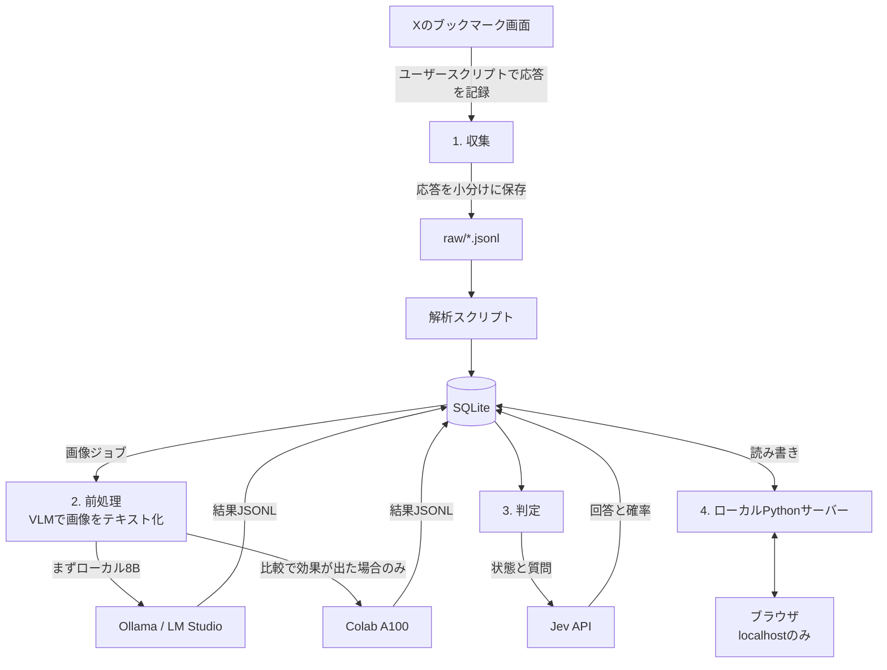

# Xブックマーク仕分けシステム 要件定義書

Sep 28, 2026 · @Carmine

本書は、X(旧Twitter)に溜まった数千件のブックマークを自動で仕分け、ブラウザで振り返れるようにする個人用システムの要件定義書である。同時に、本プロジェクトの引き継ぎ書を兼ねる。経緯を知らない読み手でも、本書だけで作業を再開できることを目指して書く。

## 0. 設計方針と本書の読み方

本プロジェクトは、本人1名が使う数千件規模の個人用ツールである。この前提を活かし、次の方針で設計する。

- **守るのは、作り直せないものだけ**。お気に入り・メモ・手動の分類修正と、収集した生の応答だけは失わないようにする。それ以外(DBの中身、VLMの結果、判定結果)は、生の応答から作り直せばよい。数千件なら、全件をやり直しても数分から数時間で済む。
- **失敗に備える仕組みより、やり直しやすさを優先する**。まれな失敗のための複雑な管理は持たない。問題が起きたら、その工程を全件やり直す。
- **決めていないことは、意図的に決めていない**。分類体系や閾値などは、データを見てから決める方が良い。11節に一覧し、いつ何を見て決めるかだけを書く。レビューや実装の際に「書き漏れ」と扱わないこと。

各要件には、必要に応じて次の区分を付ける。

| 区分 | 意味 |
| --- | --- |
| 【必須】 | 初期版で必ず満たす |
| 【簡易】 | 初期版では簡単な方法で済ませる。より厳密な方法は検討済みだが採らない |
| 【将来】 | 必要になったら導入する。今は作らない |

区分の付いていない要件は【必須】として扱う。

## 1. 背景と現状

- ブックマークが千単位で溜まっており、目で見て仕分けるのは現実的でない。
- 公式APIのブックマーク取得は、[最新の800件までしか返さない](https://docs.x.com/x-api/posts/bookmarks/integrate)。数千件を扱うには、ログイン済みのブラウザ画面から読み込む以外に方法がない。
- **ただし、ブラウザ画面でも最古まで遡れる保証はない**。800〜1,000件前後でスクロールが止まるという報告がある一方、それ以上遡れたという報告もあり、[挙動は一定していない](https://www.bookmarx.co/guides/x-bookmarks-disappeared)。本プロジェクト最大の未確定事項であり、自作スクリプトによる最初の収集(10節ステップ1)そのものが検証になる。
- 投稿には、文字、外部リンク、画像、動画・GIF、引用といった材料が**組み合わさって**含まれる。
- 内容は、tips系(実用的な知識)、熟読したい考察、イラストや3DCGなどに分けられると想定している。
- 2026年9月28日時点で、要件の整理と外部レビューへの対応が終わった段階であり、実装にはまだ着手していない。

#### Xの利用規約との関係

Xの利用規約は、公開されたインターフェース以外によるアクセスを禁じ、[クローリングやスクレイピングを、形式や目的を問わず事前の書面による同意なしに禁止している](https://x.com/en/tos)。本プロジェクトの収集は、自分のブックマークを自分のブラウザで読む形であっても、この条項に抵触しうる。

以前の版では「利用者自身が操作するため、自動化と見なされにくい」と書いていたが、これは**検知されにくさ**の話であり、**規約上許されるか**とは別の問題である。両者を混同していたため訂正する。利用者はこのリスクを理解したうえで、自分のアカウントで、自分のブックマークに限って収集することを選んだ。最初の収集の結果を踏まえ、収集を実施するかを改めて判断する。

### 1.1 前提と対象範囲

本書の読み手が前提を誤らないよう、暗黙になりがちな条件を明記する。

| 項目 | 内容 |
| --- | --- |
| 対象サービス | X(旧Twitter)のブックマーク機能。1アカウント分 |
| 投稿の言語 | 大半が日本語。英語も一部含む |
| 想定件数 | 数千件(正確な数は未確認。取得できる範囲も未確認) |
| 利用者 | 本人1名のみ。多人数での同時利用は考えない |
| 動作環境 | Windows想定のPC1台(RTX 3060 Ti、VRAM 8GB)。加えてGoogle Colab(2027年3月まで、割り当ては保証されない) |
| ブラウザ | 未確定。最初の収集で使ったブラウザと拡張機能の版を記録し、以降は固定する |
| ネットワーク | 常時接続を前提とする。画像は表示のたびに取得する |
| 外部に送るデータ | 投稿本文・引用元本文・画像内の文字・リンクカードの文言をJevへ送る。画像URLをColab(Google)へ渡す。閲覧アプリ自体は外部に公開しない |

**対象に含むもの**

- 通常の投稿。文字・外部リンク・画像・動画・引用が**組み合わさった**ものも含む
- 引用投稿(引用元の本文も保存し、判定の材料に含める)
- スレッドの一部の投稿(ブックマークした投稿のみを対象とし、前後の投稿は追わない)
- 動画・GIFを含む投稿(サムネイル画像のみをVLMに渡す。動画本体は解析しない)
- 鍵アカウントの投稿のうち、ログイン中に閲覧できるもの(収集はするが、Jevへ送る前に除外するかは未決。11節を参照)

**対象に含まないもの**

- ブックマーク以外の投稿(いいね、リポスト、自分の投稿)
- 取得できなかった投稿や、削除済みの投稿の復元
- リンク先のページ本文、動画本体、スレッドの前後の投稿の読み込み
- 音声スペース、投票などの特殊な投稿形式の詳細な解析(本文のみ扱う)

## 2. 目的とゴール

最終的なゴールは、溜まったブックマークをブラウザ上で振り返れることである。分類はそのための手段であり、分類の精度を突き詰めることよりも、探しやすい形で整理されていることを優先する。

**ゴール**

- **取得できた範囲の**ブックマークがすべてDBに入り、取得できなかった範囲があれば、その事実と理由が記録されている。「全件取得できた」とは、10節の検証で確認できた場合にのみ言う。
- 各投稿に、材料の属性(画像あり・動画あり・外部リンクあり・引用あり)と、分類(消費のしかた・話題)が付いている。
- ブラウザ上で、分類・属性による絞り込みと、キーワード検索ができる。
- お気に入りと手動の分類修正を付けられ、再判定しても失われない。
- 各投稿から元の投稿へ移動できる。元の画像が見られなくなっても、本文と画像の説明文は読める。

**非ゴール(今回はやらないこと)**

- 画像や動画のローカル保存(URL参照とする)。
- 他人との共有や、公開サービスとしての運用。
- 新しいブックマークのリアルタイムな自動仕分け(将来の拡張候補とする)。
- ブックマークの解除の自動検出(初期版では、再収集は追加と更新のみとする)。
- 画面から遡れない古いブックマークを、ブックマークの解除などで無理に掘り起こすこと。

## 3. 全体構成

処理は「収集 → 前処理 → 判定 → 閲覧」の4工程からなり、各工程の結果はすべて一つのSQLiteに集約する。



画像は保存せずURL参照とするため、DBに入るのはテキスト、判定結果、利用者の印のみである。GPUを要するのは前処理だけであり、まずローカルの8Bクラスで処理し、Colab A100の大規模モデルは同じ画像での比較で改善が確認できた場合にのみ使う。閲覧はブラウザから直接DBを開くのではなく、ローカルのPythonサーバーを介して読み書きする。

## 4. 機能要件

### 4.1 収集

収集の目的は、**取得できた範囲を正確に記録すること**である。「全件取れた」ことを前提にせず、どこまで取れ、なぜ止まったかを後から説明できるようにする。

#### 方式

- Violentmonkeyなどのユーザースクリプトとして実装する。ページのJavaScript実行環境に注入し、ブックマーク取得の通信の応答を**複製して**読む。元の画面の動作を変えない。
- 既存ツールtwitter-web-exporter(TWE)のソース調査に基づき、通信の横取りはXHRのみとし、`@grant unsafeWindow` と `@run-at document-start` でページの文脈に注入する。fetchは、XHRで何も拾えなかった場合にだけ足す。対象の操作名は `Bookmarks`、投稿は `data.bookmark_timeline_v2.timeline.instructions` の `TimelineAddEntries` の `entries` にある(TWEのソースからの推測。実物では未検証)。
- 画面の表示(DOM)ではなく、生のJSON応答を保存する。後から何度でも解析し直せるようにするためである。
- スクロールは「開始」ボタンを押している間だけ自動で進める。間隔は1〜3秒程度のばらつきを持たせる。利用者が常に止められる状態を保つ。
- **収集中にブックマークの解除をしない**。まとめて解除すると、それより古い投稿が読み込めなくなる不具合が[報告されている](https://devcommunity.x.com/t/i-found-bookmark-server-bug/255798)。

#### 保存と再開

- 応答はメモリに溜めず、一定件数ごとに小分けのファイルへ書き出す。タブを閉じても、それまでの分は残る。
- 再開は、先頭からスクロールし直し、既に保存した投稿を重複として除く方式とする。【簡易】
- 保存ファイルには、Cookieや認証トークンを含めない。応答本文のみを保存する。

#### 収集の記録【簡易】

収集のたびに、取得した投稿数、最も古い投稿の日時、止まった理由(自分で止めた / それ以上読み込まれなくなった / エラーが出た)を、簡単なテキストで残す。「どこまで遡れたか」を後から確かめるためである。専用のテーブルや詳細な自動判定は作らない。

#### 最後まで遡れなかった場合の代替策【将来】

最初の収集で古いブックマークまで届かなかった場合にだけ、次を試す。

- **ブックマーク内の検索**:スクロールで出てこない古いブックマークでも、ブックマーク内の検索では見つかるという報告がある。検索結果の通信も同じように記録できる。ただし知っている言葉でしか引けないため網羅はできない。どの投稿にも含まれそうな語で繰り返し検索して拾い集める手はあるが、検索結果の件数に上限があるかは未確認である。

ブックマークを解除して古いものを表示範囲に押し上げる方法も考えられるが、採らない。Xのブックマークは利用者の本来の保管場所であり、本システムはそれを整理して振り返るためのものである。整理のためにブックマークを減らすのは本末転倒である(2節の非ゴールを参照)。

### 4.2 前処理(テキスト化)

Jevはテキストしか読めないため、すべての投稿を一つのテキスト(Jevの用語では「状態」)に揃える。

#### 材料は属性として持ち、存在するものをすべて足す

投稿の「形式」を一つに決めて処理を分岐させると、画像と外部リンクを併せ持つ投稿などで材料を落とす。そこで形式は排他的な分類にせず、次の属性を独立に持つ。

| 属性 | 真となる条件 | 状態に足す材料 |
| --- | --- | --- |
| has\_image | 静止画を1枚以上含む | 画像ごとのVLM結果 |
| has\_video | 動画またはGIFを含む | サムネイル画像のVLM結果(動画本体は解析しない) |
| has\_external\_link | X以外のURLを含む。投稿自身の画像URLや引用投稿のURLは数えない | リンクカードのタイトルと説明文 |
| has\_quote | 引用投稿である | 引用元の本文(引用元の画像は解析しない) |

「文字のみ」は、上記がすべて偽の場合として導出する。材料が欠けている場合(カードが無い、引用元が取得できないなど)は空文字に変換せず、「欠損」として記録する。

#### VLMに行わせること

1枚の画像につき、次をJSON形式で出力させる。

- **画像の種類**:イラスト / 3DCG / 写真 / スクリーンショット / 図解・チャート / その他(1つ選ぶ)
- **説明文**:日本語で2〜3文。何が写っているかを述べる
- **画像内の文字**:読み取れる文字をそのまま書き起こす。文字がなければ空にする

VLMの出力が読めなかった、説明を拒否した、画像を取得できなかった場合は、「失敗」として理由と一緒に記録し、処理を止めずに次へ進む。失敗した分は、後でまとめてやり直す。

#### 文字の多い画像の扱い

縦長のスクリーンショットを長辺1024pxに縮めると、読むべき文字が潰れる。文字主体の画像(VLMが「スクリーンショット」「図解・チャート」と判定したもの)は縮小せず、縦に分割して入力するか、OCR専用の処理を使う。どちらにするかはステップ4で決める。

**画像内の文字は全文を保存する**。Jevへ送る状態が長すぎる場合に切り詰めるのは送信時だけとし、検索にはいつでも全文を使う。

#### 実行場所:まずローカル、効果があればColab

前処理はローカルの8Bクラス(4bit量子化、Ollama / LM Studio)を既定とする。Colab A100で大規模モデルを使うのは、ステップ4で同じ画像を比べ、検索と分類への改善が確認できた場合だけである。【将来】

- 大規模モデルを使う場合、32Bクラスは16bitでは重みだけで約64GBとなり、A100の40GBには載らない。FP8か4bitの量子化版を使う。
- ローカルとColabで、処理内容と出力形式は同じにし、モデルだけを差し替える。どちらのモデルで処理したかは結果に残す。
- VRAMに載るかは、文字の多い縦長の画像を含めて実測する。

#### 前処理の運用上の注意

- `pbs.twimg.com` への同時接続数は控えめにし(4〜8程度)、失敗したら少し待ってやり直す。
- 一部の画像だけ処理できた投稿も判定に進める。残りが後で成功したら、その投稿を判定し直す。

### 4.3 判定

分類は一つの一覧に混ぜず、独立した軸に分ける。同じ投稿が複数の性質を同時に持つためである(例:イラストであり、かつ繰り返し見返したいもの)。Jevは一回の呼び出しで複数の質問に同時に答えられるため、軸を分けても費用と時間はほぼ変わらない。

#### 分類の軸

| 軸 | Jevの型 | 値 |
| --- | --- | --- |
| 消費のしかた | Choice(単一) | 即時型 / 熟読型 / 鑑賞型 / リンク誘導型 / 情報不足 |
| 話題 | 未確定(11節) | LLM・AI、OSS・ライセンス、イラスト、3DCGなど。候補も方式もデータを見て決める |
| 実用性 | Noul | 実用的な知識や手順を含むか |

以前の版にあった「見返す価値」(Score)は削除した。「本人が見返したい度合い」は本人の好みを渡さずには定義できず、判定が安定しないためである。この役割はお気に入り(利用者が手で付ける)に任せる。

#### 「消費のしかた」の定義

この軸は、**投稿そのものを受け取るのに何が要るか**を、手元にある材料から判断する。リンク先・動画本体・スレッド全体は読まないため、実際に要する時間を保証する分類ではない。

| 値 | 定義 | 例 |
| --- | --- | --- |
| 即時型 | 見た瞬間に使える、または思い出せれば足りる | ショートカット、設定値、設定手順の図解 |
| 熟読型 | 投稿そのものに、腰を据えて読む必要のある内容がある | 長い考察、分析、書籍の紹介 |
| 鑑賞型 | 読むのではなく眺めるためのもの | イラスト、3DCG、写真 |
| リンク誘導型 | 本体が投稿の外(リンク先・動画)にあり、投稿は入口にすぎない | 記事の紹介文+URL、動画の告知 |
| 情報不足 | 材料が欠けていて判断できない | 画像の取得に失敗した画像のみの投稿 |

重なった場合は、**主な利用目的**で1つを選ぶ。例えば設定手順の図解は画像だが、目的は使うことなので即時型とする。「情報不足」は「どれにも当たらない(その他)」とは別の値であり、材料が揃えば再判定の対象になる。境界例は、ステップ5のラベル付けで見つかったものを本表に追記していく。

#### 話題について

話題の候補と、1つを選ぶか複数を付けるかは、意図的に決めていない。「LLMを使った3DCG制作」のように話題が重なる投稿は多いと予想されるため、複数を付けられる方式(候補ごとにNoulで尋ねる)が有力だが、実データで重なりがどの程度あるかを見てから決める。

#### 要確認の判断

確信の低い判定は「要確認」として閲覧画面で絞り込めるようにする。Choiceは回答に付く `confidence`(0〜1)で判断し、Noulは確信度を返さないため確率が中間(0.5付近)のものを要確認とする。具体的な値はステップ5で決める。確信を持ったまま誤る判定は閾値では拾えないため、ステップ5の評価で別に確かめる。

#### Jevへ送る状態の組み立て

投稿ごとに、次の順で連結した1つのテキストを送る。項目が無ければその行を省く。欠損した材料は `(取得できず)` と明記する。

```markdown
[本文]
(投稿の本文)

[引用元]
(引用元の本文)

[リンク]
(カードのタイトル) — (カードの説明文)

[画像1]
種類: (イラスト/写真/…)
説明: (VLMの説明文)
文字: (画像内の文字)

[画像2]
…
```

- Jevの上限は、1リクエスト全体で64kトークン、**状態と最長の質問を合わせて32kトークン**である。質問の定義も入力に含まれる。
- 状態が長いほど精度が変わることが[公式に示されている](https://docs.typesafe.ai/models)ため、状態は短く保つ。上限を超えそうな場合は、画像内の文字を切り詰める(DBには全文が残っている)。
- **実際に送った状態・質問・回答をすべて保存する**。以前の版では「元のテーブルから再生成できる」として保存しない方針だったが、元のテーブルが更新されると過去の入力は再現できない。数千件のテキストであれば保存の負担は小さい。

#### モデルの版とJevの採否

- 別名 `jev-latest` は新版の公開で参照先が変わる。閾値を決めたら、その版のID(現在は `jev-1.13.0`)に固定する。
- ステップ5で手付けのラベルと比べ、日本語で十分な精度が出るかを確かめる。出なければ、汎用LLMによる判定などに切り替える。
- ラベル定義と判定基準は英語で書き、投稿本文は日本語のまま入れる。

### 4.4 閲覧

#### 構成

- ローカルで動くPythonのWebサーバーがDBを扱い、ブラウザはそのサーバーとだけ通信する。ブラウザからDBを直接開かない。
- サーバーは閲覧用の読み出しと、利用者の印(お気に入り・手動の分類修正・メモ)の書き込みを提供する。以前の版の「読み取り専用で開く」は、お気に入りの保存と矛盾していたため訂正する。
- サーバーは `127.0.0.1` のみで待ち受け、同じネットワークの他の機器からは使えないようにする。
- 投稿本文は、HTMLとして解釈せず文字として表示する。投稿に含まれた文字列がスクリプトとして動くのを防ぐためである。
- 初期版では、一括処理(前処理・判定)と閲覧を同時に動かさない運用とする。DBへの同時書き込みの問題を避けるためである。

#### 機能

- 消費のしかた・話題・属性・要確認・お気に入りで絞り込み、キーワードで検索できる。
- お気に入りを付け外しできる。
- 分類を手で直せる。軸ごとに直し、直した値は自動判定より優先して表示する。手動の修正は解除して自動判定に戻せる。
- 詳細ページから、元の投稿へ直接移動できる。
- 画像が表示できなくても、本文・画像の説明文・画像内の文字と、元投稿へのリンクは必ず表示する。
- 将来の拡張として、埋め込みによる意味検索を追加できる構造にしておく。

#### 画像の扱い

画像は保存せず、`pbs.twimg.com` のURLから直接表示する。URLに `name=` を付けるとサーバー側が縮小した画像を返すため、自前でリサイズする必要はない。ただし、この指定が静止画・GIF・動画サムネイルのすべてで効くかは未検証であり、ステップ1で確かめる。

| 場面 | 指定 | 目安 |
| --- | --- | --- |
| 一覧 | `name=small`(`format` 指定は効くものに限る) | 長辺680px、数十KB |
| 詳細 | `name=large` | 十分に大きく、原寸ではない |

- 一覧は1ページ50件程度のページ分割とし、画像には `loading="lazy"` を付ける。
- 画像が表示できなくても、本文・画像の説明文・元投稿へのリンクは表示する。
- キャッシュは自前で管理せず、ブラウザのHTTPキャッシュに任せる。
- 原寸のダウンロードは既存の拡張機能に任せ、本アプリでは扱わない。

### 4.5 工程間の受け渡し

各工程は別々の言語・別々の場所で動くため、受け渡しの形だけは先に決めておく。細かな項目はステップ2で実データを見て確定する。

| 境界 | 受け渡すもの | 形式 |
| --- | --- | --- |
| 収集 → 解析 | 記録した生の応答 | `raw/` フォルダの小分けのJSONLファイル(1行1応答) |
| 解析 → DB | 投稿・画像・リンク | SQLiteへ直接書き込む |
| DB ⇄ VLM | 画像の一覧と結果 | JSONL(Colabを使う場合もDrive経由で同じ形式) |
| DB ⇄ Jev | 状態と質問、回答 | Pythonから直接呼び出し、送受信の全文をDBに保存する |
| DB ⇄ 閲覧 | 表示データと利用者の印 | ローカルPythonサーバーを介して読み書きする |

#### 最低限の決まり

- 文字コードはUTF-8、1行1レコードのJSONLとする。読めない行は飛ばしてログに残し、残りは取り込む。
- **XのIDは必ず文字列として扱う**。64bit整数であり、JavaScriptの数値にすると精度を失う。
- 同じ投稿・同じ画像の結果を取り込んだら、上書きする。やり直したいときは、その工程を全件やり直せばよい。
- 結果には、使ったモデル名と処理日時を残す。
- 実装言語は、収集のみJavaScript(ユーザースクリプト)、それ以外はPythonとする。
- JevのAPIキーは環境変数 `TYPESAFE_API_KEY` から読み、ソースコードやノートブックに書かない。

#### 検討したが、今は採らないもの【将来】

レビューで、実行ごとのID管理、入力のハッシュによる差分判定、ファイルごとの版番号、古い結果による上書きの防止が提案された。いずれも正しい指摘だが、全件をやり直せば済む規模では手間に見合わない。再処理の時間が問題になったとき、または継続的な増分処理を始めるときに導入する。

## 5. データ設計

データは二つに分けて考える。**作り直せるもの**と**作り直せないもの**である。

| 種類 | 置き場所 | 失ったとき |
| --- | --- | --- |
| 生の応答 | `raw/` フォルダのJSONLファイル | 作り直せない(削除された投稿は再取得できない) |
| 利用者の印(お気に入り・メモ・手動の分類修正) | SQLiteのuser\_marksテーブル | 作り直せない |
| 投稿・画像・リンク | SQLite | 生の応答から解析し直せる |
| VLMの結果、Jevの判定 | SQLite | やり直せる |

#### テーブル(初期案)

列の詳細はステップ2で実データを見て確定する。

| テーブル | 主な列 |
| --- | --- |
| posts | 投稿ID、投稿者、本文、投稿日時、元投稿URL、has\_image・has\_video・has\_external\_link・has\_quote、引用元の本文、ブックマーク対象か、最終確認日時 |
| media | 画像ID、投稿ID、並び順、種別、元のURL、処理状態、画像の種類、説明文、画像内の文字、モデル名、処理日時 |
| links | 投稿ID、展開済みURL、カードのタイトル・説明文 |
| labels | 投稿ID、各軸の値と確率・確信度、要確認の印、送った状態と質問、受け取った回答、モデルの版、判定日時 |
| user\_marks | 投稿ID、お気に入り、メモ、各軸の手動修正、更新日時 |

- 引用元の投稿は、引用した側の投稿に本文を持たせるだけでよい。独立した投稿としては扱わない。【簡易】
- 手動修正は自動判定より優先して表示し、消せば自動判定に戻る。
- 分類体系を変えたとき、手動修正が消えたカテゴリを指していれば、その投稿を要確認に回す。カテゴリの統合・分割の細かな移行規則は作らない。【簡易】

#### 運用上の決まり

- **再収集は、追加と更新だけを行う**。今回の収集に現れなかった投稿を「ブックマークから外れた」とはみなさない。分割収集や途中停止では、残っている投稿の大半が現れないためである。
- DBの構造を変えるときは、user\_marksを退避し、DBを作り直し、user\_marksを戻す。移行スクリプトは作らない。【簡易】
- 大きな作業(全件の再判定、DBの作り直し)の前に、DBファイルと `raw/` フォルダをコピーしておく。

#### 検索

- 検索対象は、本文・引用元の本文・画像の説明文・画像内の文字・リンクカードの文言とする。
- 初期版は部分一致検索(`LIKE`)とする。数千件なら十分に速い見込みである。SQLiteのFTS5(trigram)は3文字未満の語(「AI」「絵」など)に一致しないため、遅さが問題になった場合にのみ併用する。【将来】

## 6. 使用技術と実行環境

| 領域 | 技術 | 備考 |
| --- | --- | --- |
| ローカル実行環境 | RTX 3060 Ti(VRAM 8GB)搭載のPC | 前処理(既定)、判定、閲覧サーバーを動かす |
| GPU(条件付き) | Google Colab A100(VRAM 40GB) | Google AI Proの計算ユニット。2027年3月まで。割り当ては保証されない |
| 収集 | Violentmonkey(ユーザースクリプト、JavaScript) | ブラウザと拡張機能の版はステップ1で記録して固定する |
| 解析・判定・閲覧サーバー | Python | 収集以外はすべてPythonで書く |
| ローカルVLM | Ollama または LM Studio | どちらもOpenAI互換APIを持つ。比較はLM Studio、一括処理はOllamaが扱いやすい |
| VLMの候補 | Qwen3-VL-8B(ローカル)、Qwen3-VL-32B・Qwen3.6-27B・Qwen3.6-35B-A3B(Colab) | 数十枚で比較してから決める |
| 判定 | [Jev](https://docs.typesafe.ai/models)(TypeSafe AI)、版は `jev-1.13.0` に固定 | ステップ5で代替案と比べて採否を確定する |
| 保存 | SQLite | 一つのファイルで完結する |
| 閲覧 | ローカルPythonサーバー + ブラウザ | サーバーの枠組みは未決 |

**Jevの要点**

- 文章を生成せず、型付きの答え(真偽の確率、選択肢、順序付きスコア)を返す判定専用モデルである。2026年9月15日公開、同月下旬に早期アクセスが解除された。
- エンドポイントは `POST https://api.typesafe.ai/v1/systemone` である。
- 価格は入力100万トークンあたり0.042ドルで、出力は無料である。
- 1リクエスト全体で64kトークン、状態と最長の質問を合わせて32kトークンが上限である。
- レート制限は毎分1,200リクエストだが、需要に応じて予告なく変わりうると公式に書かれている。
- 主な訓練言語は英語で、日本語を含むCJKは英語ほどの精度ではないとされる。
- 「ハルシネーションしない」とは、スキーマ外の値を返さないという意味に過ぎない。確信を持って誤ることはある。
- 顧客の送信内容は学習に使わないとされる。データを保持しない契約(ZDR)は企業向けのみである。

**VLM運用の注意**

- 写真・イラストは長辺1024px程度に縮めてから渡す。文字主体の画像の扱いは4.2節に従う。
- ローカルではコンテキスト長を4096程度に抑える。
- 日本語の画像内テキストは難度が高い。ベンチマーク[JaWildText](https://arxiv.org/pdf/2603.27942)では、評価したモデルの中で最も成績の良いQwen3-VL-8Bでも総合0.64にとどまる。ただし同論文は32Bクラスを比べておらず、規模を上げたときの改善幅は示していない。改善はステップ3の実測でのみ判断する。

**Colab運用の注意【将来】**(ステップ4でColabを使うと決めた場合のみ。既存の引き継ぎメモを本件に合わせて修正)

- A100は接続した瞬間から課金される。GPUの要らない準備はCPUランタイムで済ませる。ただしランタイムを切り替えるとローカルディスクは消えるため、準備したものはDriveに置く。
- 結果は一定件数ごとに小分けのファイルとしてDriveへ書く。処理の最後に `drive.flush_and_unmount()` を一度呼び、再マウントして件数を確かめてから持ち帰る。
- ランタイムを切り替えたら必ず先頭のセルから実行する。ポート8080を使わない。既存のライブラリを `pip install -U` で更新しない。

## 7. 非機能要件

以下の見積もりは、件数・画像数・トークン数が未実測の段階の概算である。ステップ1で実際の件数と画像数を、ステップ4・5で1件あたりの処理時間とトークン数を測り、見直す。

| 項目 | 目標・見積もり | 前提 |
| --- | --- | --- |
| 費用(Jev) | 1ドル未満 | 投稿3,000件。1回の入力は状態に質問の定義を加えて1,500〜3,000トークン。合計450万〜900万トークンで0.2〜0.4ドル。再判定を数回しても1ドルに届かない |
| 処理時間(Jev) | 3,000件で数分 | 1回70〜500ミリ秒。逐次なら最大25分かかるため、8並列程度で送る |
| 費用(VLM・ローカル) | 電気代のみ | ― |
| 処理時間(VLM・ローカル) | 未実測 | 画像の枚数は投稿数と一致しない。1枚あたりの時間をステップ4で測る |
| 計算ユニット(Colab・使う場合) | 未実測 | A100標準で約5.4 CU/時。準備・転送・推論・再試行を分けて測る。月の付与は200 CU |
| 再実行性 | 各工程を全件やり直せる。同じ結果を二度取り込んでも重複しない | ― |
| 閲覧の応答 | 一覧の文字情報は1秒以内に出る。画像の読み込み時間は別に測る | 1ページ50件程度のページ分割 |
| 外部との境界 | 閲覧サーバーは `127.0.0.1` のみ。外部送信は1.1節の表に挙げたものに限る | ― |
| 規約への配慮 | 1節の「Xの利用規約との関係」を参照 | ― |

見積もりは2026年9月時点の公開情報に基づく。

## 8. 制約・リスクと対策

| リスク | 影響 | 対策 |
| --- | --- | --- |
| 画面から古いブックマークまで遡れない | 目標の「数千件の仕分け」が成り立たない | 最初の収集で確かめる。遡れなければ4.1節の代替策を試し、それでも届かなければ対象範囲を明示してゴールを修正する |
| Xの利用規約はスクレイピングを形式を問わず禁じている | アカウントの制限など | 利用者がリスクを理解したうえで判断する。自分のブックマークに限り、低速で行う。これはリスクを下げる工夫であり、規約上の許可ではない |
| 収集中のブックマーク解除で、古い投稿が読めなくなる | 取得範囲が減る | 収集が終わるまでブックマークを解除しない |
| Xの画面や通信の仕様が変わる | 収集が動かなくなる | 生の応答を保存しておけば、解析だけ直せばよい |
| VLMのOCRが日本語を読み違える | 検索と分類の精度が落ちる | 文字主体の画像は縮小しない。必要ならステップ4で大規模モデルと比べる |
| Jevの日本語精度が足りない | 誤分類 | ステップ5で手付けのラベルと比べる。足りなければ判定方式を替える |
| Jevの版が変わる | 同じ入力で結果が変わる | 閾値を決めたら版のIDに固定する |
| 作り直せないデータの喪失 | お気に入り・手動修正・生の応答を失う | 大きな作業の前にDBと `raw/` をコピーする |

## 9. 決定事項とその理由

後任者が同じ議論を繰り返さないよう、2026年9月22日までに決めたことと理由を残す。

| 決定事項 | 理由 | 検討して退けた案 |
| --- | --- | --- |
| 公式APIは使わない | 公式APIは最新の800件までしか返さず、数千件を扱えない | 公式APIによる取得 |
| 収集はユーザースクリプトで生の応答を記録する | 画面から読める範囲で最も情報が多く、後から解析し直せる。規約上のリスクは1節のとおり残り、利用者が承知のうえで選んだ | Playwrightによる全自動収集(自動化の度合いが高い)、DOMの解析(情報が少なく壊れやすい) |
| 遡れる範囲は、自作スクリプトの最初の収集で確かめる | 既存のスクリプトも同じ画面を同じようにスクロールするため、結果は変わらない。先に試しても収集の方法は変わらず、二度手間になる | 既存のスクリプトで先に検証する案(以前の版) |
| スクロールは半自動とする | 数千件を手で送るのは現実的でない。利用者が常に止められる状態を保つ | 完全手動、完全自動 |
| 再収集は追加と更新のみとする | 分割収集や途中停止では、現れない投稿を「解除された」と判断できない | 差分で存在フラグを下ろす案(以前の版。誤りとして撤回) |
| 材料は排他的な「形式」でなく、併存できる属性で持つ | 画像と外部リンクを併せ持つ投稿などで、材料を落とさないため | 文字のみ・URL付き・画像付きから1つ選ぶ案(以前の版) |
| 分類は「消費のしかた」「話題」「実用性」の軸に分ける | 同じ投稿が複数の性質を同時に持ち、一つの一覧に混ぜると重複して破綻する | tips・イラスト・3DCGなどを一列に並べる案 |
| 「消費のしかた」は主な利用目的で1つ選び、「リンク誘導型」と「情報不足」を設ける | 本体が投稿の外にあるものは、手元の材料では消費時間を判断できない。「その他」と「判断できない」は意味が違う | 「数秒で済むか」を機械的に判断できるとした案(以前の版。リンク付き投稿で成り立たない) |
| 話題の方式(単一か複数か)は実データを見て決める | 重なりの程度は実データを見ないと分からない。複数ラベルが有力 | 単一選択 |
| 「見返す価値」の軸は削除し、お気に入りに任せる | 本人の好みを渡さずには定義できない | Scoreで判定する案(以前の版) |
| 話題の候補はデータから見つける | 先に決めると実際の中身とずれ、「その他」が膨らむ | 最初から固定する案 |
| Jevの入出力の全文を保存する | 元のテーブルが変わると過去の入力は再現できない。数千件なら負担は小さい | 保存せず再生成する案(以前の版) |
| Jevの採否は評価データで代替案と比べて決める | 日本語の精度が未確認であり、前提にしてよいかは実測でしか分からない | Jevを無条件に採用する案 |
| LightGBMへの蒸留は見送る | 一度の仕分けではJevの確率をそのまま使えば足りる。新規分の継続的な自動仕分けが必要になった時点で再検討する | Jevの確率を教師にした蒸留 |
| 前処理はローカルを既定とし、Colabは効果が確認できた場合のみ使う | Colabは期限と割り当ての保証がなく、大規模モデルの改善幅も未確認。最初から二つの経路を作ると手間が倍になる | 初回は必ずColabで処理する案(以前の版) |
| 画像内の文字は全文を保存し、切り詰めはJevへ送るときだけ行う | コマンドや固有名詞など、検索に必要な情報を失わないため | OCRを優先的に切り詰める案(以前の版) |
| 画像はURL参照とし、保存しない | 利用者の方針による。`name=` で縮小版が得られる見込み | 画像のローカル保存 |
| 閲覧はローカルPythonサーバーを介してDBを読み書きする | お気に入りと手動修正の保存が必要。以前の版の「読み取り専用」は矛盾していた | ブラウザから読み取り専用で開く案 |
| 検索は部分一致から始める | trigramは3文字未満の語に一致しない。数千件なら部分一致で足りる見込み | 最初からFTS5・trigramのみで作る案 |
| 動画は本体を解析せず、サムネイルのみ扱う | 動画解析は費用と複雑さに見合わない | 動画のフレーム抽出と解析 |
| 自前で閲覧画面を作る | 分類を自分の感覚で定義でき、データが手元に残る | 既存のブックマーク管理サービス |

加えて、全体に関わる判断として次を決めた。

| 決定事項 | 理由 | 検討して退けた案 |
| --- | --- | --- |
| 失敗に備える仕組みより、やり直しやすさを優先する(0節) | 本人1名・数千件の規模では、全件をやり直しても数分から数時間で済む。まれな失敗のための管理は、開発を遅らせ、個人開発の身軽さを損なう | 実行ID・入力ハッシュ・版番号・移行スクリプトなどによる厳密な管理(レビューで提案。【将来】として保留) |
| 分類体系・閾値などは意図的に未確定とする(11節) | データを見る前に決めると、実際の中身とずれる | 計画段階で決め切る案 |
| 収集スクリプトは自作する。ただしTWEの作りを手本とし、コードを流用する(MIT) | TWE v1.4.3のソースを調べた結果、生の応答を捨てて投稿だけを整形して保存するため、並び順(sortIndex)と削除済み投稿の記録が書き出しに残らない。作り直せない生の応答を守るという0節の方針に反する。自作部分は200行程度で済む | TWEをそのまま使う案、TWEに自動スクロールだけを足す案(受け渡しがTWEの内部形式に縛られ、TWEの変更にも追随が必要になる) |

## 10. 開発ステップ

**次に着手するのは、ステップ1「収集スクリプトの作成と最初の収集」である**。画面から古いブックマークまで遡れるかは、この最初の収集で分かる。その結果によって目標の範囲が変わりうるため、後続工程の詳細はそれまで確定させない。

以前の版は、収集から閲覧までの各工程を順に完成させ、最後に使い勝手を確かめる計画だった。これでは、分類が検索の役に立たないと分かる頃に大半の実装が終わっている。そこで、少量のデータで端から端まで先に通し、各段階に「次へ進む条件」を置く形に改めた。

| ステップ | 作業 | 次へ進む条件 |
| --- | --- | --- |
| 1 | 収集スクリプトを作り、まず約100件で保存の漏れがないかを確かめ、そのまま最後までスクロールする。`name=` 指定の効き方も確かめる | どこまで遡れたかが分かっている。届かなければ4.1節の代替策を試し、それでも届かなければ対象範囲を利用者が決める |
| 2 | 取得した実データを見て、DBの列を確定する | 実データが問題なく取り込める |
| 3 | 約100件で、解析 → ローカル8Bの前処理 → 仮の分類での判定 → 閲覧 を端から端まで通す | 検索・絞り込み・お気に入り・手動修正が動く |
| 4 | 約50枚の実画像(文字の多い縦長の画像を含む)で、ローカル8Bの読み取りを確かめる。不十分なら大規模モデル(Colab)と比べる | 前処理のモデルと、Colabを使うかが決まっている |
| 5 | 約200件から話題の候補を出して分類体系を決める。100件程度を手でラベル付けし、Jevの一致率を見て閾値を決める | 判定方式と閾値が決まっている |
| 6 | 全件の前処理・判定を行う | 失敗した分を把握し、やり直しを済ませている |
| 7 | 実際に使ってみて、必要な調整をする | 下記の完了の定義を満たす |
| 8 | 増分の取り込み手順を整える | 新しいブックマークをローカルだけで追加処理できる |
| 9 | (任意)埋め込みによる意味検索を追加する | ― |

### 完了の定義

次がすべて満たされた時点で、本要件は達成とする。

- [ ] 収集できた範囲が分かっており、遡れなかった範囲があれば記録されている
- [ ] 画像の前処理の失敗が、理由付きで把握されている
- [ ] 手付けのラベルと比べて、判定の一致率が目標以上である(目標値はステップ5で決める)
- [ ] 事前に選んだ「後で探したい既知の投稿」10件以上を、検索や絞り込みで見つけられる
- [ ] お気に入りと手動修正が、再判定後も残っている
- [ ] 詳細ページから元の投稿へ移動できる
- [ ] 新しいブックマークを、ローカルだけで追加処理できる

「要確認の割合」は完了の条件にしない。閾値を下げるだけで達成できてしまい、分類の質を測れないためである。

## 11. 意図的に未確定としている事項

以下は、書き漏れではなく、**今の段階で決める必要がない、または決めない方が良い**ために未確定としている事項である。決める時期と、判断の材料だけを定める。

| 事項 | 決める時期 | 判断の材料 |
| --- | --- | --- |
| 収集の実施可否と対象範囲 | ステップ1の後 | 画面から遡れた範囲 |
| 使うブラウザと拡張機能 | ステップ1 | 検証に使ったもの |
| DBの列の詳細 | ステップ2 | 実際の応答の構造 |
| VLMのモデル・量子化・画像の上限、Colabを使うか | ステップ4 | 実画像での読み取り結果と、VRAMの実測 |
| 文字主体の画像の扱い(分割かOCR専用か) | ステップ4 | 縦長のスクリーンショットでの結果 |
| 話題の候補と、単一か複数か | ステップ5 | 約200件の実データ |
| 閾値と一致率の目標値 | ステップ5 | 手付けのラベルとの比較 |
| 判定方式(Jevか他の方法か) | ステップ5 | 日本語での一致率 |
| 鍵アカウントの投稿をJevへ送るか | ステップ5まで | 実際に含まれている量 |
| 閲覧サーバーの枠組み | ステップ3 | 作りやすさ |
| 増分の取り込み頻度 | ステップ8 | 実際の使い方。蒸留を再検討する条件にもなる |

## 12. レビュー対応記録

2026年9月28日、本書を別のAIに批評させ、25件の指摘を受けた。指摘をそのまま受け入れるのではなく、各項目を公式資料などで確かめたうえで判定した。本書の書き手(Claude)にも自分の記述を正しいとみなす傾向があるため、判定の根拠を残す。

判定の凡例:**採用**=指摘どおり直した。**採用(誤り)**=本書の記述が誤っていた。**一部採用**=問題の認識は受け入れ、直し方は変えた。

| # | 指摘の要旨 | 判定 | 対応と根拠 |
| --- | --- | --- | --- |
| 1 | 全件を取得できたと判定する根拠がない | 採用 | 調べると、画面でも800〜1,000件前後でスクロールが止まるという報告があり、指摘より深刻だった。ステップ0を新設し、ゴールを「取得できた範囲」に改めた(1・2・4.1・10節) |
| 2 | 収集方式の採用理由が規約と食い違う | 採用(誤り) | 規約がスクレイピングを形式を問わず禁じていることを確認した。「検知されにくい」と「許される」を混同していた。公式APIは800件上限のため不採用とし、理由を明記した(1・9節) |
| 3 | 今回見つからない投稿を「解除された」と誤認する | 採用(誤り) | 再収集は追加と更新のみとした(5節) |
| 4 | 取得済みIDだけでは再開もデータ保全もできない | 採用 | 小分け保存、保存成功後に取得済みとする、再開は先頭から再走査、とした(4.1節) |
| 5 | `fetch` の差し替えで全応答を取れるとは限らない | 採用 | ステップ0・1で検証し、操作名で特定する。なお、既存のスクリプトが同じ方式で動いている実績があり、方式自体の実現性は高いと見ている(4.1節) |
| 6 | JSONLに揃えただけでは契約にならない | 採用 | `schema_version`、IDの文字列化、識別子の規則、正常例と失敗例を加えた(4.5節) |
| 7 | 投稿・引用・応答の保存単位が整合しない | 採用 | 生の応答を応答単位で保存し、引用元はpostsに区別付きで入れ、欠損に印を付ける(5節) |
| 8 | 「形式」が排他的で材料を落とす | 採用(誤り) | 併存できる属性に改めた(4.2節) |
| 9 | 冪等性と再推論が混同されている | 採用 | 冪等性を「重複取り込みで不整合が起きない」と定義し、`input_hash` と `run_id` を導入した(4.5節) |
| 10 | 失敗状態と進行条件が足りない | 採用 | 処理状態・試行回数・材料不足の印と、失敗の種類ごとの扱いを定めた(4.2・5節) |
| 11 | モデル名だけでは結果を再現できない | 採用(誤り) | 公式資料で、別名 `jev-latest` は参照先が変わり、閾値調整後は版の固定が勧められていることを確認した。送受信の全文を保存する方針に改めた(4.3節) |
| 12 | カテゴリ変更で手動修正の意味が壊れる | 採用 | カテゴリに不変のIDと移行先を持たせ、手動修正を軸ごとに保存する(5節) |
| 13 | 分類軸が重複と情報不足を表現できない | 一部採用 | 話題の複数ラベル化、「情報不足」の分離、「機械的に判断できる」の撤回は受け入れた。ただし軸は捨てず、本体が投稿の外にあるものを「リンク誘導型」として分ける形で直した(4.3節) |
| 14 | 確率・確信度・見返す価値の意味が固定されていない | 採用 | 公式資料で、Noulが `confidence` を返さないことを確認した。軸ごとに要確認の条件を分け、「見返す価値」は削除した(4.3節) |
| 15 | 完了条件が分類の質を測っていない | 採用 | 要確認の割合を条件から外し、評価用データでの正解率・高確信の誤り・既知の投稿の検索を加えた(10節) |
| 16 | A100 40GBに32Bが載る条件が足りない | 採用(誤り) | 会話の中で「量子化なしでも動く」と述べたのは誤りだった。16bitでは重みだけで約64GBになる(4.2節) |
| 17 | OCRの重視と縮小・切り詰めの方針が衝突する | 採用(誤り) | 画像内の文字は全文保存、文字主体の画像は縮小しない、と改めた。引用したベンチマークが32Bを比べていないことも確認し、改善は実測で判断するとした(4.2・6節) |
| 18 | Colabの保存手順が安定した再開手順になっていない | 採用 | `flush_and_unmount()` は最後に一度とし、小分けファイルを一時名から正式名に変える方式にした。ランタイム切替でローカルディスクが消える点も明記した(6節) |
| 19 | 見積もりに未検証の前提が重なる | 採用 | 公式資料で「状態と最長の質問で32k」の制約を確認し、追記した。並列の前提と、画像数が投稿数と一致しない点も明記した。費用が1ドル未満という結論は変わらない(7節) |
| 20 | 読み取り専用ではお気に入りを保存できない | 採用(誤り) | ローカルPythonサーバーを介して読み書きする構成に改めた(4.4節) |
| 21 | trigramでは3文字未満の語が見つからない | 採用 | 部分一致検索から始め、必要になればFTSと併用する(5節) |
| 22 | 外部画像が使えない場合の動作がない | 採用 | 表示の代替手順とページ分割を定めた(4.4節) |
| 23 | 「ローカルで完結」が実際のデータ経路と一致しない | 採用(誤り) | 外部に送るデータを1.1節に明記し、サーバーは `127.0.0.1` のみ、本文は文字として表示する、とした。鍵アカウントの扱いは未決事項に加えた |
| 24 | バックアップとDB変更の手順がない | 採用 | バックアップ・移行スクリプト・復元確認を定めた(5節) |
| 25 | 一回限りの整理に対して経路が多すぎる | 一部採用 | 少量で端から端まで先に通す順序に改め、Colabは効果が確認できた場合のみとした。ただし「Jevを料金だけで選んだ」という読みは当たらない。主な理由は訓練なしで分類を定義できる点である。代替案との比較は妥当なので取り入れた(9・10節) |

#### レビューになかったが、確認の過程で見つけたこと

- 収集中にブックマークをまとめて解除すると、古い投稿が読み込めなくなる不具合が報告されている。収集中は解除しないことを4.1節に加えた。
- 遡れる範囲の検証は、自作の前に既存のスクリプト(twitter-web-exporter)で行える。無駄な実装を避けるため、ステップ0に組み込んだ。ただし後に、同じ画面を同じようにスクロールする以上は結果が変わらず二度手間であるとして撤回し、自作スクリプトの最初の収集に統合した。
- 本書の以前の版に、6節の小見出しが二重に残る、用語集の見出しが出典の中に割り込む、太字の記法が表示されない、という編集上の誤りがあった。いずれも直した。

#### 過剰対応の見直し(2026年9月28日午後)

上表の対応は、指摘が事実として正しいかだけを確かめ、正しいものをほぼすべて要件に書き込んでいた。しかし、事実として正しいことと、今の段階で対処する価値があることは別である。個人用・数千件の規模に対して防御的すぎる仕組みや、意図的に未確定にしていた部分への踏み込みが含まれていたため、0節の方針を定めたうえで次のように改めた。

また、レビュー用のプロンプトが「厳しく見よ」と求める一方で、どこを意図的に未確定にしているかを伝えていなかったことも、過剰な指摘を招いた一因である。次回のレビューでは、0節と11節を読ませたうえで依頼する。

| # | 見直し前の対応 | 見直し後 | 理由 |
| --- | --- | --- | --- |
| 1 | 収集セッションを専用テーブルで詳細に記録 | 件数・最古の日時・止まった理由を簡単なテキストで残す【簡易】 | 目的は「どこまで遡れたか」を知ることだけである |
| 6 | 版番号、隔離ファイル、一時名からの改名、詳細な例 | UTF-8のJSONL、IDの文字列化、読めない行は飛ばす、のみ。列はステップ2で確定 | 実データを見る前に形式を固めすぎていた |
| 7 | 応答と投稿の対応テーブル、引用元を独立した投稿として保存 | 生の応答はファイルのまま、引用元は本文だけを持つ【簡易】 | 全件を解析し直せば足りる |
| 9 | 実行ID・入力ハッシュ・採用中の実行の管理・古い結果の上書き防止 | 同じ対象の結果は上書き。やり直すときは全件やり直す【将来】 | 数千件なら全件やり直しは数分から数時間で済む |
| 10 | 失敗の種類ごとの扱い、試行回数、工程の停止条件 | 失敗は理由と一緒に記録し、後でまとめてやり直す | 個人用では細かな分類に見合う効果がない |
| 12 | カテゴリの不変ID、移行先、統合・分割の規則 | 手動修正が消えたカテゴリを指していれば要確認に回すだけ【簡易】 | 分類体系をまだ決めていない段階で、その変更手順まで決めていた |
| 13 | 話題を複数ラベルと確定 | 未確定に戻した(11節)。複数ラベルは有力案として記す | 意図的に未確定の部分に踏み込んでいた |
| 14 | 軸ごとの要確認条件の表と保留帯 | 考え方だけを記し、値はステップ5で決める | 同上 |
| 15 | 高確信の誤りの件数と傾向の記録、復元試験などを完了条件に | 完了条件を実用に関わるものに絞った | 評価のための評価になっていた |
| 18 | 件数とチェックサムの照合など | 最後に一度確定させて件数を見るだけ。Colab自体を【将来】とした | Colabを使うか自体が未定である |
| 21 | FTSと部分一致の振り分け | 部分一致のみで始める。FTSは【将来】 | 数千件なら部分一致で十分に速い |
| 22 | 表示失敗時に元URL→説明文と順に試す | 画像が出なくても本文と説明文は出す、のみ | まれな場合のための段階的な処理は不要である |
| 24 | 移行スクリプト、構造の版、復元試験 | 構造を変えるときは利用者の印を退避してDBを作り直す【簡易】 | 作り直せないのは利用者の印と生の応答だけである |
| 25 | 10段階の進行条件に細かな検証を多数含めた | 進行条件を実用上の確認に絞った | 手戻りを防ぐための計画が、開発そのものを重くしていた |

残したものは、事実の誤りの訂正(2・3・8・16・17・20・23)、目標そのものに関わる指摘(1)、数行で済み害のないもの(Jevの送受信の保存、IDの文字列化、`127.0.0.1` での待ち受け、本文を文字として表示)である。

#### 改訂履歴

| 日付 | 内容 |
| --- | --- |
| 2026-09-22 | 初版 |
| 2026-09-28 | 収集方式、画像の扱い、分類の軸、Colabの利用を反映 |
| 2026-09-28 | 外部レビュー25件への対応 |
| 2026-09-28 | 過剰対応の見直し。0節(設計方針と区分)を新設し、11節を「意図的に未確定としている事項」に改めた |
| 2026-09-28 | 既存スクリプトによる事前検証(旧ステップ0)を、二度手間として廃止。最初の収集に統合し、遡れなかった場合の代替策を4.1節に加えた |

## 用語集

| 用語 | 意味 |
| --- | --- |
| 【必須】【簡易】【将来】 | 要件の区分。0節を参照 |
| Jev | TypeSafe AIの判定専用モデル。文章を生成せず、型付きの答えと確率を返す |
| 状態(state) | Jevに渡す入力テキストのこと。Jevの用語 |
| Choice / Score / Noul | Jevの回答の型。順に、選択肢・順序付きスコア・真偽の確率 |
| confidence | ChoiceとScoreの回答に付く、0〜1の確信度。Noulには付かない |
| VLM | 画像を読める言語モデル(Vision Language Model) |
| 量子化(Q4、FP8など) | モデルを軽くする手法。数字が小さいほど軽く、精度は落ちる |
| CU(計算ユニット) | Colabの利用量の単位。Google AI Proで毎月200付与される |
| JSONL | 1行に1つのJSONを書く形式。途中まででも読める |
| trigram | 3文字ずつ区切って索引を作る方式。3文字未満の語には一致しない |
| ユーザースクリプト | ブラウザ拡張(Violentmonkeyなど)で動かす小さなJavaScript |
| 消費のしかた | 本書で定めた分類の軸。即時型・熟読型・鑑賞型・リンク誘導型・情報不足の5値 |
| リンク誘導型 | 本体がリンク先や動画など投稿の外にあり、投稿は入口にすぎないもの |
| 利用者の印 | お気に入り・メモ・手動の分類修正。作り直せないため守る対象 |

## 出典

- [X API: Bookmarks lookup(公式)](https://docs.x.com/x-api/posts/bookmarks/integrate)(APIの800件上限)
- [X Terms of Service(公式)](https://x.com/en/tos)(スクレイピングの禁止)
- [X (Twitter) Bookmarks Disappeared?(bookmarx)](https://www.bookmarx.co/guides/x-bookmarks-disappeared)(画面で遡れる範囲の報告)
- [I found bookmark server bug(X Developers)](https://devcommunity.x.com/t/i-found-bookmark-server-bug/255798)(まとめて解除した際の不具合)
- [twitter-web-exporter(GitHub)](https://github.com/prinsss/twitter-web-exporter)(同じ方式の既存のユーザースクリプト)
- [Models - TypeSafe AI Docs](https://docs.typesafe.ai/models)(Jevの入力形式、言語、コンテキスト上限、版の固定)
- [Confidence - TypeSafe AI Docs](https://docs.typesafe.ai/confidence)(確信度の定義、Noulに確信度がないこと)
- [What Is Jev?(Firecrawl)](https://www.firecrawl.dev/blog/what-is-jev)(画像非対応、ハルシネーションの意味)
- [JaWildText: A Benchmark for VLMs on Japanese Scene Text Understanding](https://arxiv.org/pdf/2603.27942)(日本語の画像内文字の難度)
- [Best Qwen Models Ranked(InsiderLLM)](https://insiderllm.com/guides/qwen-models-guide/)(Qwen3-VLの規模とVRAM要件)
- Colab A100 活用の引き継ぎメモ(本人作成、2026年9月27日)

本書の技術情報は2026年9月28日時点のものである。X、Jev、VLMはいずれも変化が速いため、実装前に最新の情報を確認すること。
